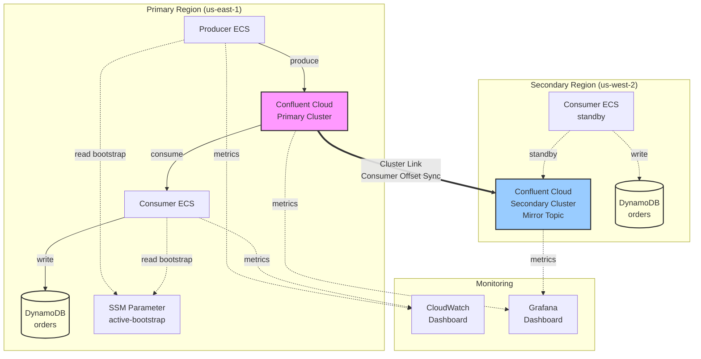

# Kafka Disaster Recovery on Confluent Cloud & AWS

[](https://github.com/username/kafka-dr-confluent-aws/actions)
[](https://www.terraform.io/)
[](https://www.python.org/)
[](LICENSE)

A production-ready, portfolio-quality demonstration of **active-passive disaster recovery** for Apache Kafka using **Confluent Cloud Cluster Linking** across AWS regions, with measured RPO and RTO.

## 🎯 Project Goals

This project demonstrates:
- **Cross-region replication** between us-east-1 (primary) and us-west-2 (secondary)
- **Automated failover** with Cluster Linking and consumer offset sync
- **Measured disaster recovery metrics** (RPO/RTO) via sequence number analysis
- **Production-grade infrastructure** with Terraform, ECS Fargate, and monitoring
- **Complete DR runbook** with scripted failover, failback, and drill procedures

## 📐 Architecture



### Key Components

| Component | Technology | Purpose |
|-----------|-----------|---------|
| **Primary Kafka Cluster** | Confluent Cloud (us-east-1) | Source cluster for production traffic |
| **Secondary Kafka Cluster** | Confluent Cloud (us-west-2) | Standby cluster with mirrored topic |
| **Cluster Link** | Confluent Cluster Linking | Cross-region replication with offset sync |
| **Producer** | Python + confluent-kafka, ECS Fargate | Generates 1,000 orders/sec with sequence numbers |
| **Consumer** | Python + confluent-kafka, ECS Fargate | Consumes and writes to DynamoDB |
| **DynamoDB** | AWS DynamoDB | Sink for consumed messages, RPO/RTO analysis |
| **Schema Registry** | Confluent Schema Registry | Schema management with Schema Linking |
| **Infrastructure** | Terraform (Confluent + AWS providers) | Full IaC for reproducible deployments |
| **Monitoring** | CloudWatch + Grafana | Real-time metrics and alerting |

## ⚡ Quick Start

### Prerequisites

- **Confluent Cloud account** with API credentials ([sign up](https://confluent.cloud))
- **AWS account** with CLI configured ([install](https://aws.amazon.com/cli/))
- **Terraform** >= 1.5.0 ([install](https://www.terraform.io/downloads))
- **Docker** (for building application images)
- **Python** 3.11+ (for running scripts locally)

### 1. Clone and Setup

```bash
git clone https://github.com/username/kafka-dr-confluent-aws.git
cd kafka-dr-confluent-aws

# Copy and configure Terraform variables
cp terraform/terraform.tfvars.example terraform/terraform.tfvars
# Edit terraform.tfvars with your credentials
```

### 2. Deploy Infrastructure

```bash
cd terraform

# Initialize Terraform
terraform init

# Review the plan
terraform plan

# Deploy (takes ~15-20 minutes)
terraform apply

# Save outputs for later use
terraform output > ../outputs.txt
```

### 3. Build and Push Application Images

```bash
# Get ECR repository URLs from Terraform output
PRODUCER_ECR=$(terraform output -raw producer_ecr_repository_url)
CONSUMER_ECR=$(terraform output -raw consumer_ecr_repository_url)

# Authenticate with ECR
aws ecr get-login-password --region us-east-1 | \
    docker login --username AWS --password-stdin ${PRODUCER_ECR%%/*}

# Build and push producer
cd ../apps/producer
docker build -t ${PRODUCER_ECR}:latest .
docker push ${PRODUCER_ECR}:latest

# Build and push consumer
cd ../consumer
docker build -t ${CONSUMER_ECR}:latest .
docker push ${CONSUMER_ECR}:latest

# Update ECS services with new images
cd ../../terraform
terraform apply -auto-approve
```

### 4. Verify Deployment

```bash
# Check ECS services are running
aws ecs list-tasks \
    --cluster kafka-dr-demo-cluster \
    --service-name kafka-dr-demo-producer \
    --region us-east-1

# Tail producer logs
aws logs tail /ecs/kafka-dr-demo-producer --follow

# Check messages in DynamoDB
aws dynamodb scan \
    --table-name kafka-dr-demo-orders \
    --select COUNT \
    --region us-east-1
```

## 🧪 Running a Disaster Recovery Drill

### Complete Automated Drill

```bash
# Run full failover → operate → failback drill
./scripts/run_drill.sh

# This will:
# 1. Record baseline metrics
# 2. Simulate primary failure
# 3. Execute failover to secondary
# 4. Measure RPO/RTO
# 5. Run on secondary for 60s
# 6. Execute failback to primary
# 7. Generate comprehensive report
```

### Manual Failover Steps

```bash
# 1. Execute failover
./scripts/failover.sh

# 2. Verify services are running on secondary
aws ecs describe-services \
    --cluster kafka-dr-demo-cluster \
    --services kafka-dr-demo-producer kafka-dr-demo-consumer

# 3. Measure RPO and RTO
./scripts/measure_rpo_rto.py \
    --table-name kafka-dr-demo-orders \
    --region us-east-1 \
    --output text
```

### Failback to Primary

```bash
# Execute failback when ready
./scripts/failback.sh

# Verify services are back on primary
aws ssm get-parameter \
    --name /kafka-dr-demo/active-bootstrap-endpoint \
    --region us-east-1
```

## 📊 Monitoring

### CloudWatch Dashboard

Access the auto-created dashboard:
```bash
# Get dashboard URL from Terraform output
terraform output cloudwatch_dashboard_url
```

Metrics available:
- ECS CPU and memory utilization
- Application logs (producer and consumer)
- Custom metrics (if instrumented)

### Grafana Dashboard

Import the provided dashboard for richer visualization:

1. Open Grafana UI
2. Go to **Dashboards → Import**
3. Upload `monitoring/grafana-dashboard.json`
4. Configure Prometheus (Confluent Cloud) and CloudWatch data sources

See [monitoring/README.md](monitoring/README.md) for detailed setup.

## 📈 Expected Results

> **Note**: These are placeholder values. Real measurements require deployed infrastructure.

| Metric | Target | Notes |
|--------|--------|-------|
| **Steady-State Mirror Lag** | < 100 messages | Cluster Link replication lag |
| **RPO (Messages Lost)** | < 10 | Measured via sequence gap analysis |
| **RTO (Recovery Time)** | < 45 seconds | Time from failure to restored service |
| **Failover Steps** | 3 automated | Promote mirror, update SSM, restart services |
| **Data Duplication** | 0 messages | With exactly-once semantics and offset sync |

## 💰 Cost Warning

**This demo incurs real AWS and Confluent Cloud costs!**

### Estimated Monthly Costs (as of September 2024)

**Note:** These are rough estimates for demonstration purposes. Actual costs will vary based on usage, region, and current pricing. Always check official pricing pages before deploying.

| Service | Configuration | Estimated Cost |
|---------|--------------|----------------|
| Confluent Cloud Primary | Basic cluster, us-east-1 | ~$720/month |
| Confluent Cloud Secondary | Basic cluster, us-west-2 | ~$720/month |
| Cluster Link | ~2.5TB/month data transfer | ~$250/month |
| ECS Fargate | 4 tasks × 0.5 vCPU, 1GB | ~$50/month |
| DynamoDB | On-demand, low volume | ~$5/month |
| Other AWS | VPC, CloudWatch, etc. | ~$25/month |
| **Total** | | **~$1,770/month** |

**Pricing References:**
- [Confluent Cloud Pricing](https://www.confluent.io/confluent-cloud/pricing/)
- [AWS ECS Fargate Pricing](https://aws.amazon.com/fargate/pricing/)
- [AWS DynamoDB Pricing](https://aws.amazon.com/dynamodb/pricing/)
- [AWS VPC Pricing](https://aws.amazon.com/vpc/pricing/)

### Cost Optimization

For development/testing:
```hcl
# In terraform/terraform.tfvars
cluster_type = "BASIC"               # Use BASIC tier
producer_replicas = 1                # Reduce to 1 task
consumer_replicas = 1                # Reduce to 1 task
enable_cloudwatch_alarms = false     # Disable alarms
```

### Teardown

**IMPORTANT**: Destroy resources when done to avoid ongoing charges:

```bash
cd terraform

# Destroy all resources
terraform destroy

# Verify clusters are deleted in Confluent Cloud UI
# https://confluent.cloud/environments

# Verify ECS services are deleted
aws ecs list-services --cluster kafka-dr-demo-cluster
```

## 🧰 Development

### Running Tests

```bash
# Producer tests
cd apps/producer
pip install -r requirements.txt
pytest tests/ -v --cov=producer

# Consumer tests
cd ../consumer
pip install -r requirements.txt
pytest tests/ -v --cov=consumer
```

### Code Quality

```bash
# Run linting and formatting
make lint

# Run all validations (Terraform, Python, shell)
make validate
```

### Makefile Commands

```bash
make help           # Show all available commands
make validate       # Terraform validate + Python lint + shellcheck
make test           # Run all unit tests
make build-images   # Build Docker images locally
make plan           # Terraform plan
make apply          # Terraform apply
make destroy        # Terraform destroy
make logs           # Tail ECS service logs
make drill          # Run DR drill
```

## 🔍 Comparison: Cluster Linking vs MirrorMaker 2

This project includes a detailed comparison with Amazon MSK + MirrorMaker 2 as an alternative DR solution.

See [comparison/COMPARISON.md](comparison/COMPARISON.md) for:
- Architecture differences
- Performance benchmarks (RPO/RTO)
- Cost analysis
- Operational complexity comparison
- Recommendations by use case

Quick summary:
- **Cluster Linking**: Lower RPO/RTO, simpler operations, higher cost
- **MirrorMaker 2**: More control, lower cost at scale, higher operational burden

## 📚 Additional Resources

### Documentation
- [Confluent Cluster Linking](https://docs.confluent.io/cloud/current/multi-cloud/cluster-linking/index.html)
- [Consumer Offset Sync](https://docs.confluent.io/cloud/current/multi-cloud/cluster-linking/consumer-offsets.html)
- [Schema Linking](https://docs.confluent.io/cloud/current/multi-cloud/schema-linking.html)
- [AWS ECS Best Practices](https://docs.aws.amazon.com/AmazonECS/latest/bestpracticesguide/intro.html)

### Scripts Reference
- `scripts/failover.sh` - Promotes secondary cluster to active
- `scripts/failback.sh` - Restores primary cluster as active
- `scripts/measure_rpo_rto.py` - Calculates RPO/RTO from DynamoDB data
- `scripts/run_drill.sh` - End-to-end DR drill orchestration

### Troubleshooting

#### Producer not producing
```bash
# Check producer logs
aws logs tail /ecs/kafka-dr-demo-producer --follow

# Verify API keys
aws secretsmanager get-secret-value \
    --secret-id kafka-dr-demo-producer-credentials
```

#### Consumer lag increasing
```bash
# Check consumer logs
aws logs tail /ecs/kafka-dr-demo-consumer --follow

# Check DynamoDB throttling
aws cloudwatch get-metric-statistics \
    --namespace AWS/DynamoDB \
    --metric-name ThrottledRequests \
    --dimensions Name=TableName,Value=kafka-dr-demo-orders \
    --start-time 2024-01-01T00:00:00Z \
    --end-time 2024-01-01T01:00:00Z \
    --period 300 \
    --statistics Sum
```

#### Mirror lag too high
```bash
# Check cluster link status in Confluent Cloud UI
# https://confluent.cloud/environments/<env-id>/clusters/<cluster-id>/cluster-linking

# Verify network connectivity between regions
# Check Confluent Cloud status page
```

## 🤝 Contributing

Contributions are welcome! Please:
1. Fork the repository
2. Create a feature branch (`git checkout -b feature/amazing-feature`)
3. Run tests and validation (`make validate test`)
4. Commit changes (`git commit -m 'Add amazing feature'`)
5. Push to branch (`git push origin feature/amazing-feature`)
6. Open a Pull Request

## 📄 License

This project is licensed under the MIT License - see the [LICENSE](LICENSE) file for details.

## 🙏 Acknowledgments

- Confluent for Cluster Linking and Schema Linking capabilities
- AWS for ECS Fargate and managed services
- The Kafka community for MirrorMaker 2 as an open-source alternative

## 📧 Contact

- **Author**: Your Name
- **Email**: your.email@example.com
- **LinkedIn**: [your-profile](https://linkedin.com/in/your-profile)
- **Blog**: [your-blog.com](https://your-blog.com)

---

**Built with ❤️ as a portfolio project demonstrating disaster recovery best practices for Apache Kafka**
